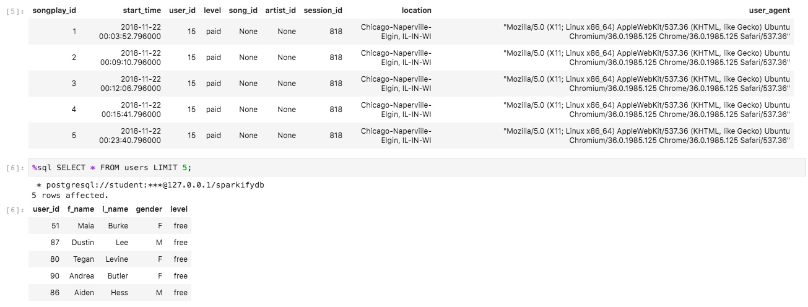
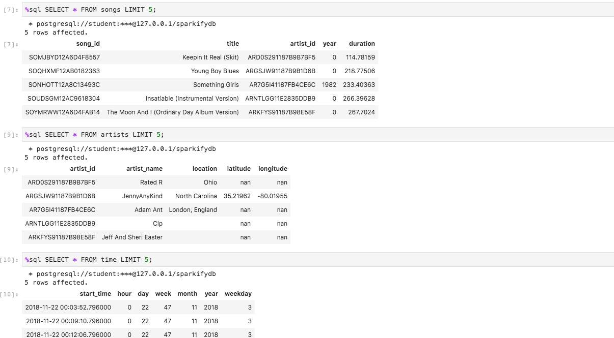

This project creates music dataset tables in Postgres using Python code and does ETL (Extract, Transform, Load) to get, match and insert data into tables.

# sql_queries.py - contains the SQL statements to create tables and queries to insert data into them.
# create_tables.py - contains the database connections and calls the processes to create and drop tables from sql_queries.py
# etl.py - runs the processes from start to end to process logs, run queries, do ETL and manipulate data to match and fill in contents of the tables.
# test.ipynb is an interactive python file to test if tables were populated with content and to view a sample of those contents.
# Output.txt is the file containing the output from running etl.py on the command line.

Run create_tables.py first on each run to wipe out any old data and re-create tables and queries by doing this:
 - Click on terminal (or File -> New -> Terminal)
 - python3 create_tables.py
 - check by opening test.ipynb by clicking on it and running it
 - Code boxes should have some output message or records.
If no errors, then on the command line, run etl.py this way:
 - python3 etl.py
 - view the console output for completion.
 - run test.ipynb again to view records of tables.

